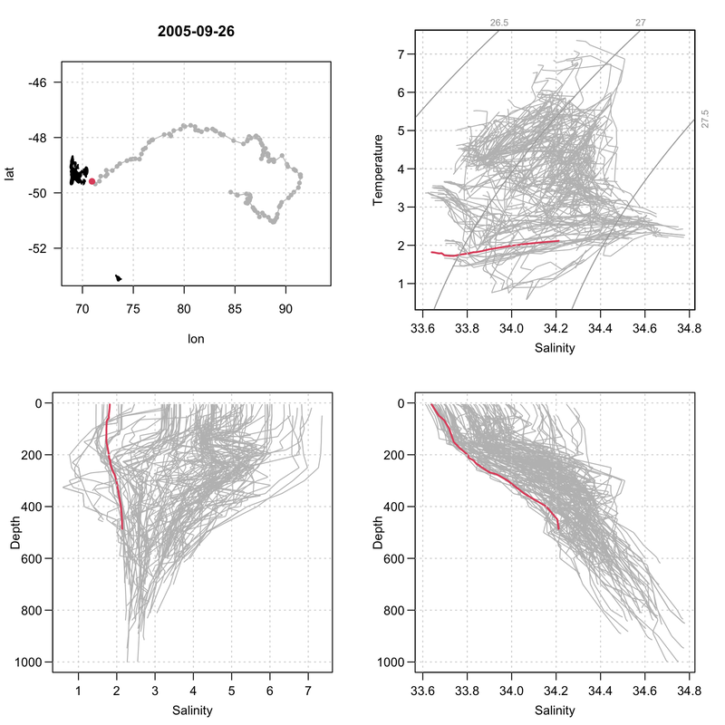

# Read_MEOP
Load and plot ncdf files of temperature and salinity profiles sampled by marine mammals :\\
Load_MEOP.R : open and read the ncdf files.\\
Plot_MEOP.R : plot locations, profiles, T-S diagram, sections of properties along time.\\
Animate_MEOP.R : animate locations, T-S diagram and profiles with time.\\

The dataset is available on [SEANOE](https://www.seanoe.org/data/00343/45461/)

